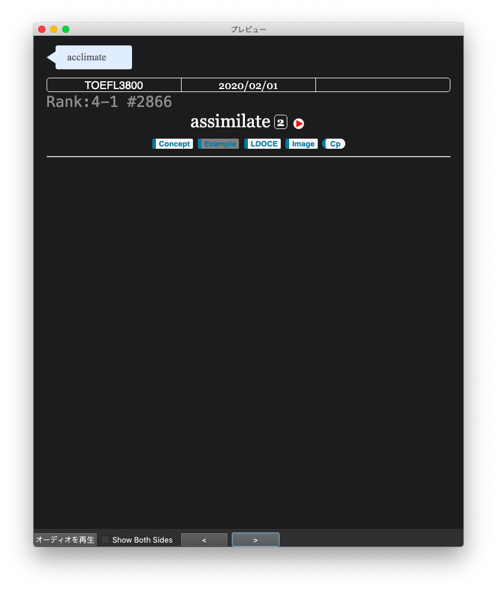
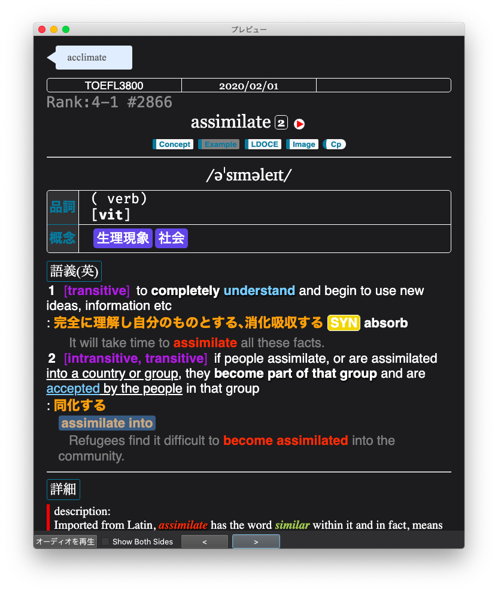
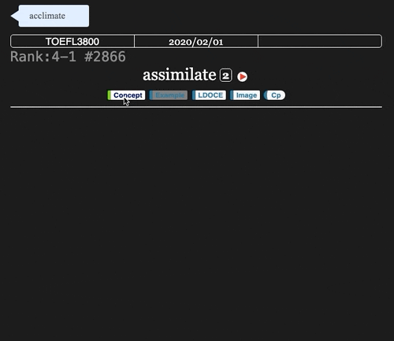
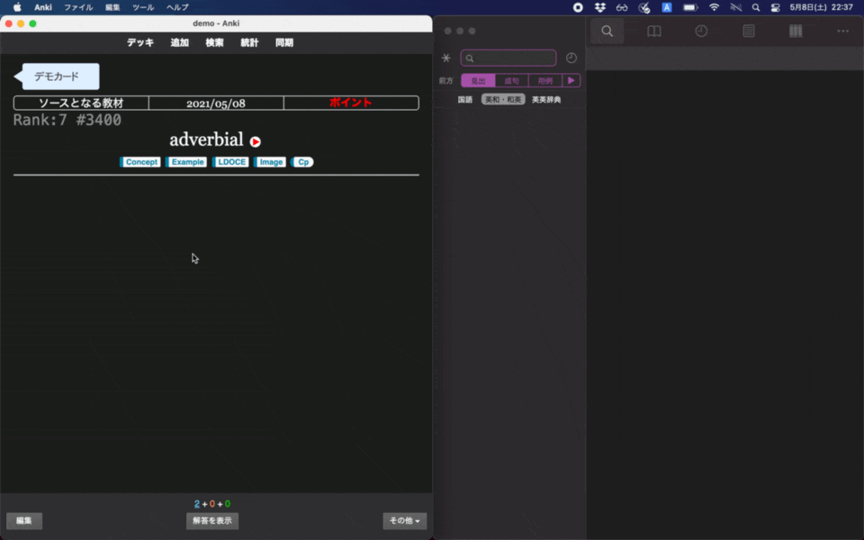

# 英単語用テンプレート
Ankiの英単語学習カード用のテンプレートです。共有用にリファクタリングしました。単語学習にご自由にお使いください。モバイル版に対応しているため画面幅によってレイアウトなどが変わります。

また、作成者は様々なアドオンを入れた上でこのカードを作成しているので作成者の環境以外での完全な動作は保証しません。あらかじめご了承ください。改造や参考にすることをおすすめします。

# 機能
- ヒントボタン(ヒントがない場合にはボタンがグレーアウト)
- 単語をクリップボードにコピーするボタン
- 反転カードの生成
- タイピングによるスペルチェッカー
- iframeによる画像索窓
- Google検索窓
- 物書堂辞書アプリへのリンク
- 各種サイトでの英単語検索機能
- 画面幅によるレイアウト変更
- TTS(TextToSpeech)による音声自動読み上げ

# デモ

表面 | 裏面
--|--
 | 

ヒントボタン | レイアウト変更
--|--
 | 

実際の使用デモ(mac版物書堂辞書に対応)

# フィールド構成
フィールド構成は以下になります。すべてのフィールドを必ずしも使う必要はなく、予備としてのフィールドが多数です。

順番 | フィールド名 | 説明 |
--|--|--
1 | Word | 英単語
2 | Comment | 気になったことをメモ
3 | CreatedDay | 作成日 
4 | Source | ソースとなる材料の名前(例: TOEFL3800)
5 | Rank | ランク
6 | Number | 番号
7 | ImpPoint | 重要な部分など
8 | Symbol | 発音記号
9 | WordType | 品詞
10 | DetailType | 詳しい品詞分類
11 | Keywords | キーワード
12 | WordForms | 語彙変形
13 | List | リスト
14 | Grammar | 文法
15 | TheNumOfMean | 多義語の語数
16 | StrikeJap | 日本語の意味をグレーアウト
17 | Meaning_ja | 日本語の意味
18 | Meaning_en | 英語の意味
19 | SpellSimilar | 似た単語
20 | Description | 説明
21 | Etymology | 語根
23 | ExampleSentence | 例文
24 | SourceS | ソースとなる文章
25 | Source_Twitter | Twitterからのソース
26 | SourcePhoto | ソースとなる写真があれば
27 | Colloaction | コロケーション
28 | Peripheral | 周辺概念など(wikipediaなど)
29 | Derivative | 派生語
30 | Thesaurus | シソーラス
31 | SynAnt | 同義語と反意語
32 | PhotoImage | 語彙イメージ
33 | Add Reverse | 反転カードを作る場合に1を入力
34 | Typing?? | 反転カードでタイピングする場合に1を入力

# 使い方

1. デモデッキをそのままAnkiで開く
2. 必要なフォントなどがあればインストールする

このカードはBasic(表裏反転可能カード)を元に作成しているため、`Add Reverse`フィールドに何かしらの文字(1など)を入力すると反転カードが生成されます。`Add Reverse`を有効化した上で`Typing??`フィールドに何かしらの文字(1など)を入力すると単語のスペルチェックができます。反転カードのデザインは`-reverse`がついたhtmlファイルに入っています。それぞれのファイルからAnkiのカードエディタ上にコピー&ペーストすれば使うことができます。デモ用のカードは[demo-card.apkg](demo-card.apkg)に入っています。このファイルをそのまま使うことですぐにカードを利用できます。

| ファイル | 説明 |
--|--
| [frontside.html](srcs/frontside.html) | 表面テンプレート
| [backside.html](srcs/backside.html) | 裏面テンプレート
| [frontside-reverse.html](srcs/frontside-reverse.html) | 反転カード表面テンプレート
| [backside-reverse.html](srcs/backside-reverse.html) |  反転カード裏面テンプレート
| [style.css](srcs/style.css) | 共通cssファイル